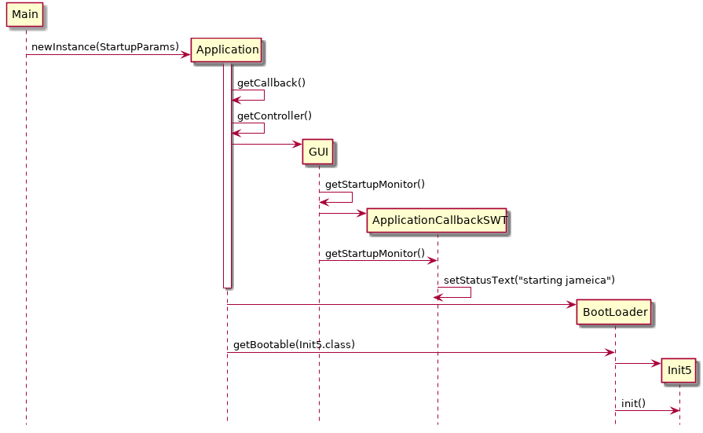
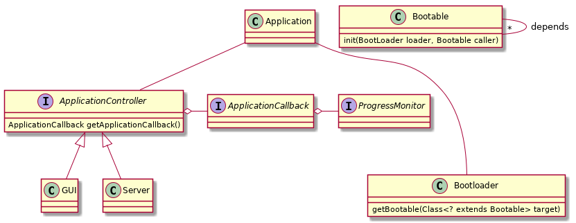

Jameica
========

OSGi like

- `Jameica <https://www.willuhn.de/products/jameica/>`_
- `Willuhn repo <https://github.com/willuhn/repositories>`_
  

	    
Entry point  
``de.willuhn.jameica.Main``
Services in Init5

	- SecurityManagerService
	- LockService
	- LogService
	- SysinfoService

	  - SysPropertyService

	- BackupService
	  
	  - Application.getMessagingFactory() => getBootable(MessagingService.class) 

	- ProxyService
	- AuthenticateService
	
	- RegistryService*
	  
	  // multicast, rmi
	  
	  - SSLService

	    - HostnameVerifierService

	- DeployService

	  - PluginSourceService

	    - ClassService

	    - getBootable(BeanService)

	- SSLService
	- SSLSocketFactoryService
	- PluginService
	- PluginServiceService
	- SearchService
	- ReminderService
	- ScriptingService
	- UpdateService

