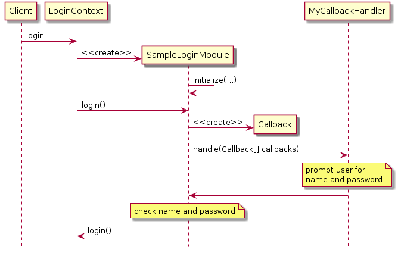
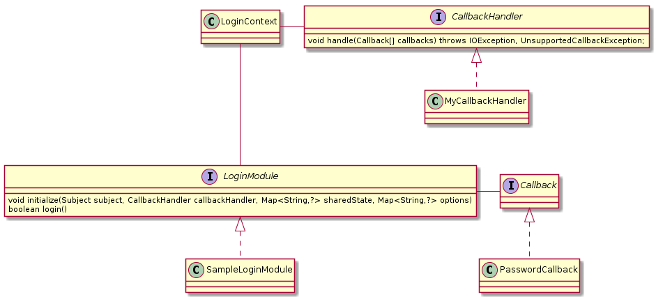

JAAS
=====

.. code-block:: java
   :caption: login context instantiation

   LoginContext lc =
      new LoginContext("Sample", // name of the entry in the jaas configuration file
          new MyCallbackHandler()); // specific callback handler

.. code-block:: shell
   :caption: jaas.config

   Sample {
      sample.module.SampleLoginModule required debug=true;
   };

   Calling the login method
	   

   Class involved in JAAS
