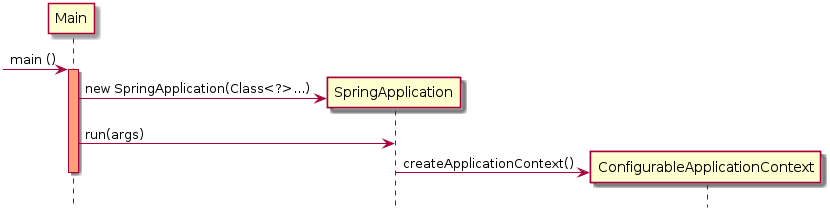

Boot
===========

@SpringBootApplication:

 - @EnableAutoConfiguration: enable Spring Boot’s auto-configuration mechanism
 - @ComponentScan: enable @Component scan on the package where the application is located (see the best practices)
 - @Configuration: allow to register extra beans in the context or import additional configuration classes

Actuator
*********
Add access point on web service to check met property as health
