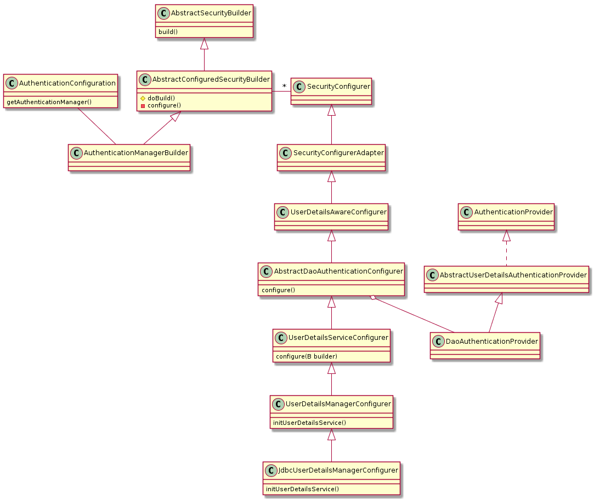

Spring
======

Boot
+++++++++
Actuator
*********
Add access point on web service to check met property as health

Spring cloud
++++++++++++++++++++

Spring coud config
*******************

Spring cloud tasks
*******************

Web
+++++

Security
++++++++

.. code-block:: java
   :caption: authenticate()
	     
   AuthenticationManager am = SpringFactory.getBean(AuthenticationManager.class);
   Authentication authentication = new UsernamePasswordAuthenticationToken("bob", "bobspassword");		
   am.authenticate(authentication);

   Accessing UserDetails
   

   AuthenticationManager

	    

   authenticationManagerBuilder

   Need to import 
   ObjectPostProcessorConfiguration
   
   EnableGlobalMethodSecurity
