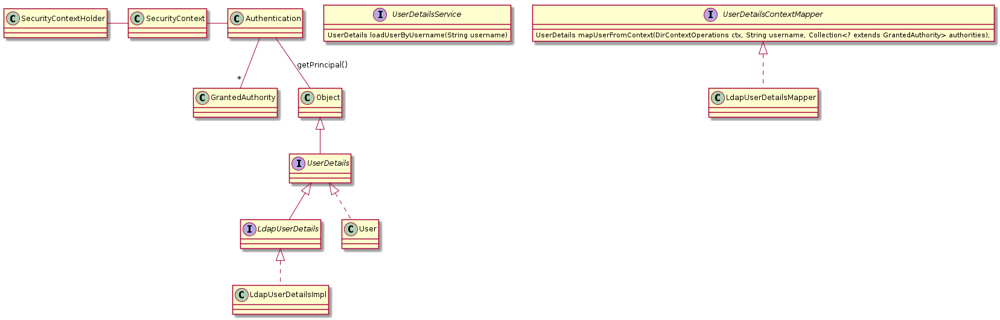
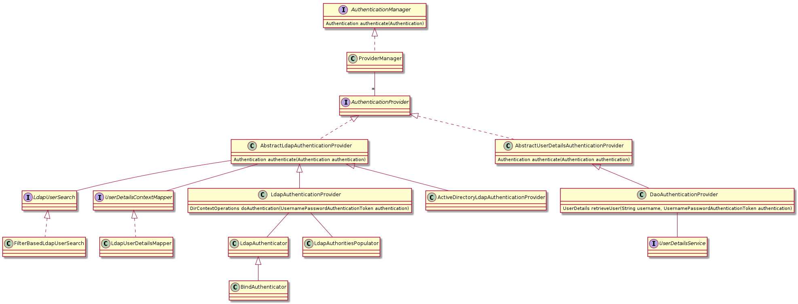
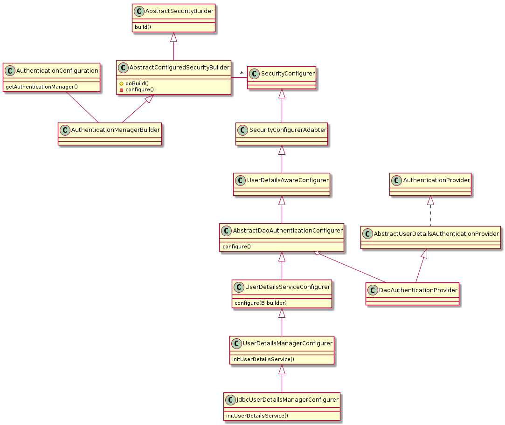

Security
===========

.. code-block:: java
   :caption: authenticate()
	     
   AuthenticationManager am = SpringFactory.getBean(AuthenticationManager.class);
   Authentication authentication = new UsernamePasswordAuthenticationToken("bob", "bobspassword");		
   am.authenticate(authentication);

   Accessing UserDetails
   

   AuthenticationManager

	    

   authenticationManagerBuilder

   Need to import 
   ObjectPostProcessorConfiguration
   
   EnableGlobalMethodSecurity
